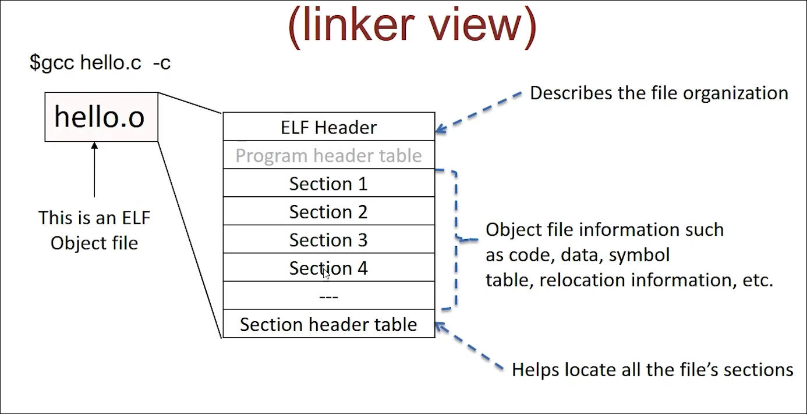
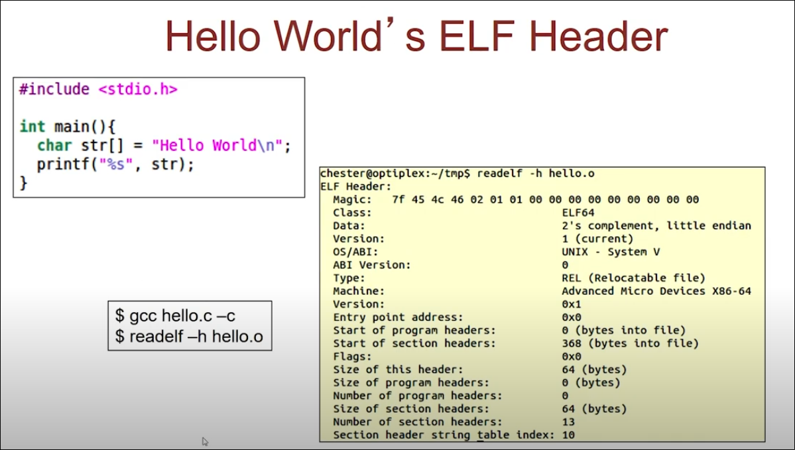
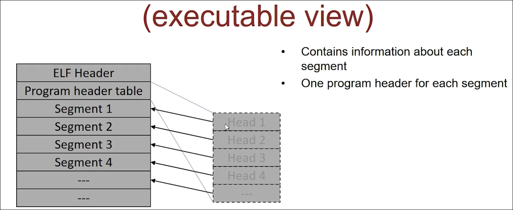
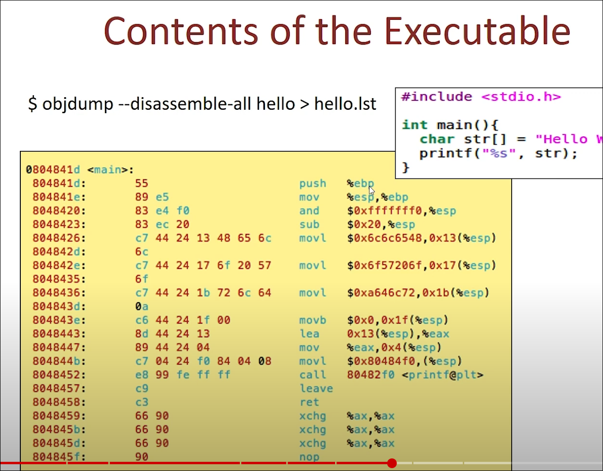
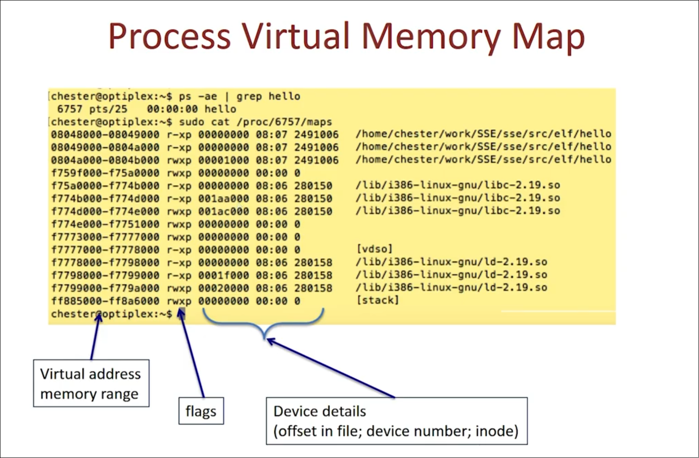
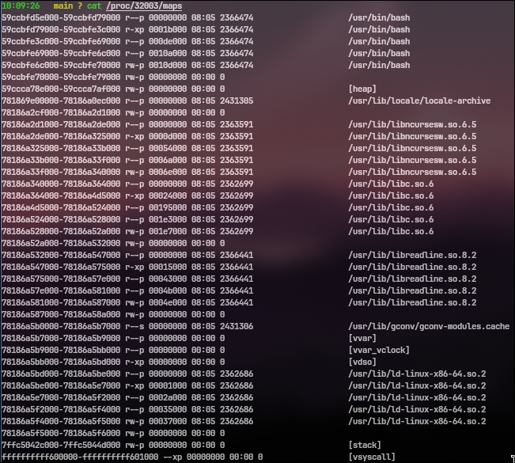
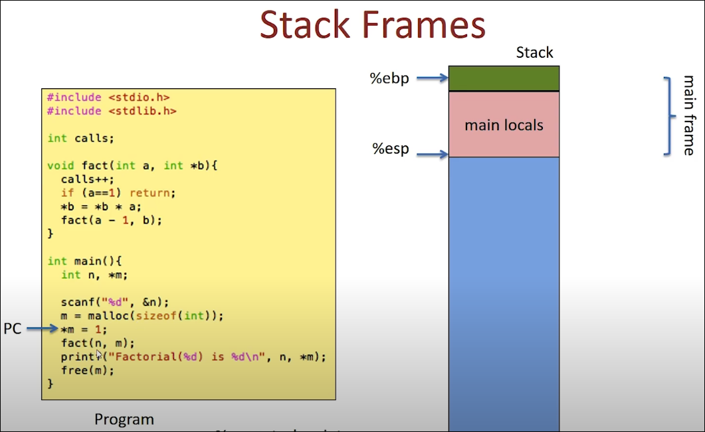
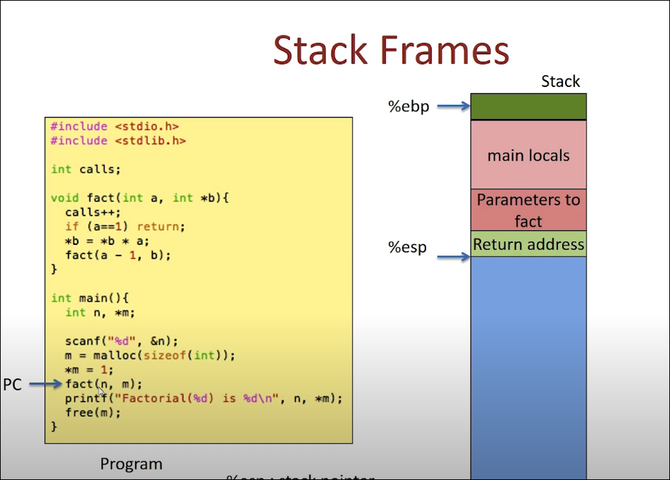
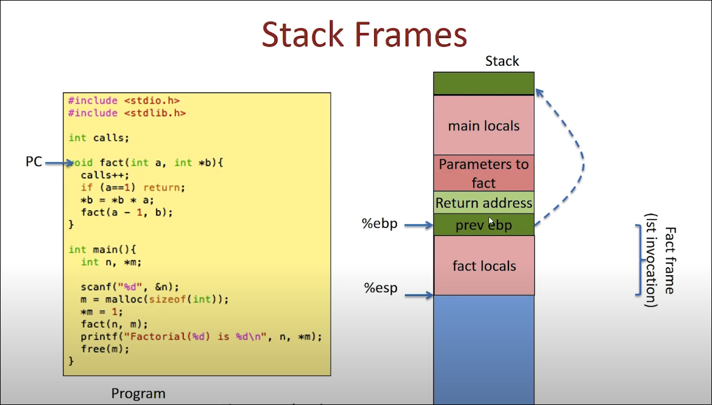
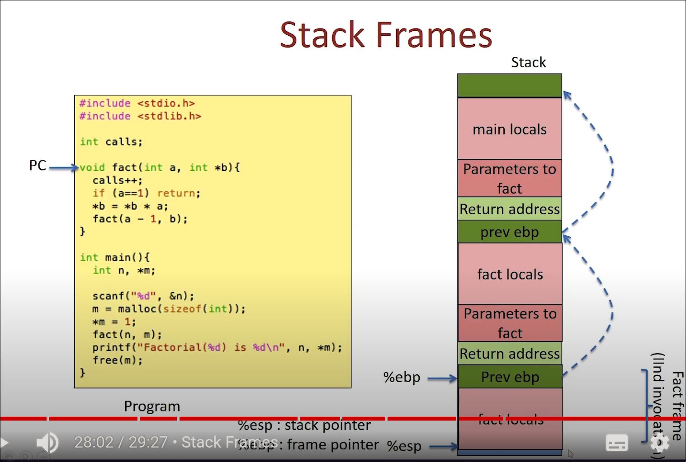

# Overview

| Content   | Links |
|--------------- | --------------- |
| How a computer is affected   | [viruses](#viruses)   |
| How viruses can enter a computer   | [Vulnerability](#vulnerability)   |
| Types of Vulnerabilities   | [designflaw](#design-flaws)<br>[hardware-flaw](#hardware-flaws)<br>[human-factors](#human-factors)<br>[bugs-in-the-program](#bugs-in-the-program) |
| How to secure a system  | [approaches](#secure-system-engineering)   |
| Program Binaries  |  [binaries](#program-binaries) <br> [object-file](#linker-view) <br> [executable-file](#executable-view) |
| Content of executable | [disassembly](#contents-of-the-executable) | 
| Process virtual memory mapping | [memory-Of-The-Tokens](#process-virtual-memory-map) |
| The of memory assignment | [tracing-The-Stack](#stack-frames)


## Viruses
- even with viruses, worms and spyware around, information is still safe as long as they do not enter the System 

## Vulnerability

- A flaw that an attacker can use to gain access to a systems

- ### Design flaws<br>
   ex: intel pentium's floating point bug [mid 19s]
    floating point operation would result in incorrent result
    exploited by cryptographer on cipher

- ### Hardware flaws<br>
   intentional hardware trojan by manufacturers, trigger and get access from the chip
  ex:   IC / process  / chip having hardware trojan

- ### Human factors
    spam emails
    embedded messages

- ### Bugs in the program
    an executable that has a Vulnerability that can be exploited by an attacker

## Programming Flaws [we focus on c / c++ , cuz lot of underlying libraries of most popular softare like kernel and VMs are written in c]

- In application software  
 1.SQL injection

<br>

- In system software
 1. buffer overflow and overheads
 2. Heap: double free, use after free
 3. Interger overflows
 4. format strings
<br><br>
- Side channel attacks [attacks on programs that are actually coded correctly]
 1. Cache timing attack
 2. Power Analysis attack
 3. Fault injection attack


## Secure System Engineering

**Approach 1** : Design flawless system <br>
eg : SeL 4 
 (Not easy to develop these systems on a large scale)

**Approach 2** : Isolate Systems <br>
Sandbox environments, virtual machines, trusted environments [trusted computing]

**Approach 3** : Detect and mitigate Attacks 

<br>

https://chetrebeiro@bitbucket.org/casl/sse.git

***
***
# Program Binaries

when you compile a program you get the ELF file 
ELF - Executable Link Format - a.out file - which is to be run to run the program 
<br><br>
`gcc hello.c -c ` - gives you the object file <br> which can be read for the linker and the executable view <br><br>
`readelf -h hello.o` - helps you read the elf header of the object file <br>
`readelf -S hello.o` - helps you read the section header of the object file **Linker view** <br>
`readelf -l hello.o` - helps you read the program header of the object file **Executable view** <br>


## Linker view 
this view is for object files - has sectors - section header table
```gcc filename.c -c``` creates a <filename.o> object file
<br>

### ELF header
```readelf -h filename.o```
<br>

Magic header is the elf idenfier
<br><br>
<br>


### Section header
```readelf -S filename.o ```
<br>

## Executable view
This is for executables - has segments so program header table 
```gcc hello.c -O hello ```
<br>

## Executable view vs Linker view 
executable view has segments while linker view has sections  
executable view has program header table while linker view has Section header table

## Program header
<br>
<br>

```readelf -l hello```

<br>


# Contents of the executable

```objdump --disassemble-all hello > hello.lst```

<br>

# Process virtual memory map
< ```ps -ae | grep <executable> ``` gives you a the pid of the process <br> In order to get a memory map cat out the `/proc/<pid>/maps`<br>
<br>
<br>
Actual Usage: <br> run a prog [running gui and heavy progs gives lengthly virtual memory map]
<br>
get its pid <br>
<br>
cat its `maps` <br>
<br>


# Stack frames

%ebp - Extended Base frame Pointer  
%esp - Extended Stack Pointer

activate frame is the frame between the base/frame pointer and stack pointer  <br>
<br>

Firstly , we have the `base pointer` for the top where the function / program is `called from` [OS]<br>
Then when the main function starts to execute - it creates variables for the storage purposes , so that is stored in the stack - call it as `main locals` <br>
<br>
then we have the `parameters passed` while calling <br> 
Along with the `return address` that the calling function provides to the called function to return it computated value [ if any ]<br>
For basic programming convention we call it main function ,while for the OS its just any other function <br> 

At this point the base pointer points to the a location `prev base pointer` after return address of this new function - to know where to go back from. 
When main calls a function [ in this case the factorial function ] it send a few arguments first that is the `parameters` of the function - which we also used to send in for calling the main function from the OS<br>
Along with it the `return address` of the called function . <br>

Now when the function executes it has the `function locals` <br>
`parameters` to the called function if it is calling any function <br> 
`return address` of the called function <br> 



%ebp  
Parameters for main  
return address  
%ebp 
main locals  
parameter to a function  
return address - given from the calling function  
%ebp  
function locals  
parameter to factor [could be itself or another ]  
return address - provided for the called function from the calling function 
$ebp   
function locals  
and so .  
.  
.  
.  

