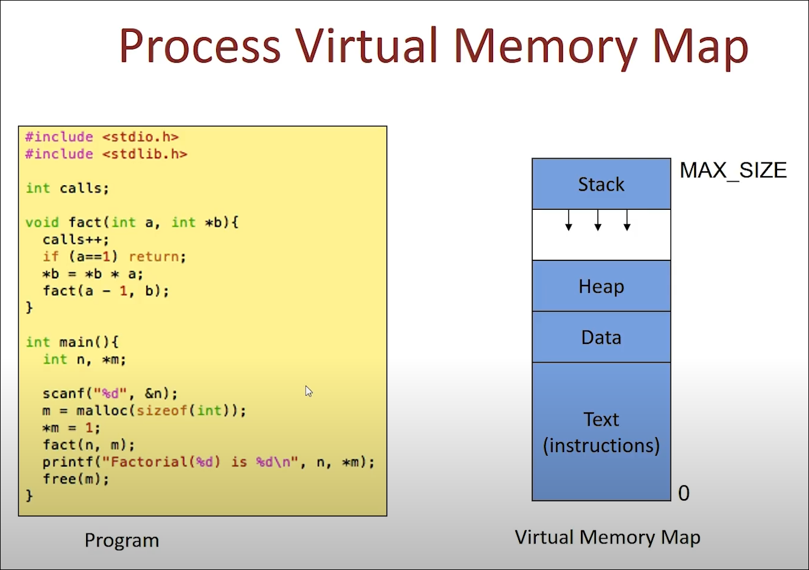
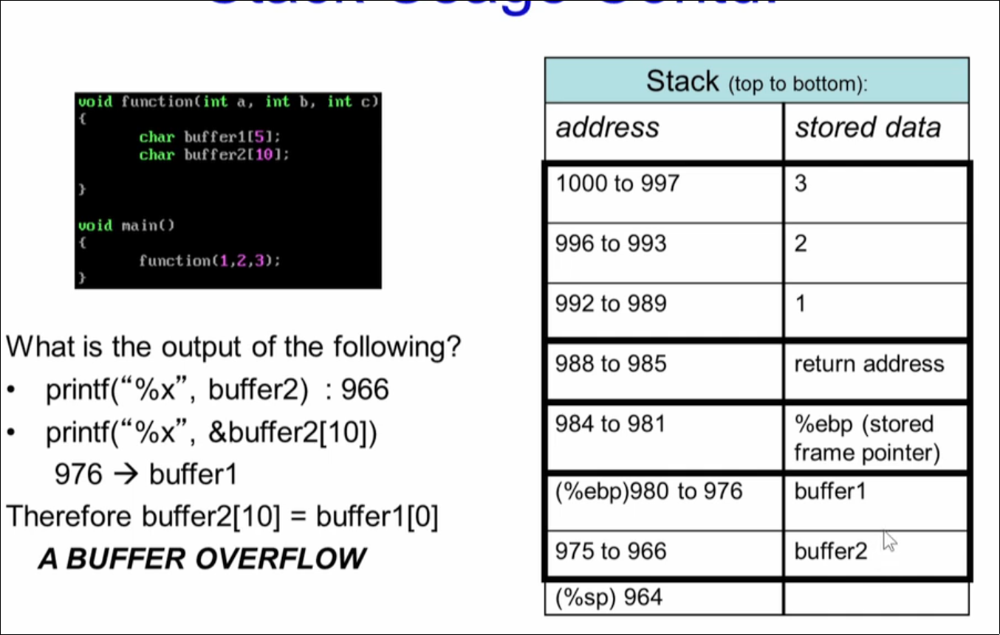

# Secure Systems
- computer systems can be considered a closed box.
- Information in the box is safe as long as nothing enters or leaves the box

# Viruses
- even with viruses, worms and spyware around, information is still safe as long as they do not enter the System 

# Vulnerability

- A flaw that an attacker can use to gain access to a systems

# Flaw
- ## Design flaw<br>
   ex: intel pentium's floating point bug [mid 19s]
    floating point operation would result in incorrent result
    exploited by cryptographer on cipher

- ## Hardware flaws <br>
   intentional hardware trojan by manufacturers, trigger and get access from the chip
  ex:   IC / process  / chip having hardware trojan

- ## Human factors
    spam emails
    embedded messages

- ## Bugs in the program
    an executable that has a Vulnerability that can be exploited by an attacker

# Programming Flaws [we focus on c / c++ , cuz lot of underlying libraries of most popular softare like kernel and vms are written in c]

- In application software
  SQL injection

- In system software
 1. buffer overflow and overheads
 2. Heap: double free, use after free
 3. Interger overflows
 4. format strings

- Side channel attacks [attacks on programs that are actually coded correctly]
 1. Cache timing attack
 2. Power Analysis attack
 3. Fault injection attack


# Secure System Engineeing

Approach 1 : Design flawless system
eg : SeL 4 
 (Not easy to develop these systems on a large scale)

Approach 2 : Isolate Systems 
Sandbox environments, virtual machines, trusted environments [trusted computing]

Approach 3 : Detect and mitigate Attacks 

<br>

https://chetrebeiro@bitbucket.org/casl/sse.git

# Program Binaries

when you compile a program you get the ELF file 
ELF - Executable Link Format - a.out file - which is to be run to run the program 
<br><br>
## Linker view 
this view is for object files - has sectors - section header table
```gcc filename.c -c``` creates a <filename.o> object file
<br>

### ELF header
```readelf -h filename.o```
<br>

Magic header is the elf idenfier


### Section header
```readelf -S filename.o ```
<br>

## Executable view
This is for executables - has segments so program header table 
```gcc hello.c -O hello ```
<br>

## Executable view vs Linker view 
executable view has segments while linker view has sections  
executable view has program header table while linker view has Section header table

## Program header
<br>
<br>

```readelf -l hello```

<br>


# Contents of the executable

```objdump --disassemble-all hello > hello.lst```

<br>

# Process virtual memroy map
```ps -ae | grep <executable> ``` gives you a virtual memory map
<br>


# Stack frames

%ebp - base frame pointer
%esp - stack pointer

activate frame is the frame between the base/frame pointer and stack pointer

%ebp
Parameters for main
return address
%ebp
main locals
parameter to a function
return address - returned from the called function
%ebp
function locals
parameter to factor [could be itself or another ]
return address
$ebp 
function locals
and so .
.
.
.


# Program Bugs
- Buffer overflow
1. In the stack 
2. In the Heap
3. Return to libc attacks
- double free 
- integer overflow
- foramt string bugs

%x gives the start of the address of the buffer  

%ebp takes 5 bytes
int takes 4 bytes

# Buffer overflow
Worm CODERED - released on 13th july 2001 
infected 359000 computers by 19th july 
targets microsoft's IIS webserver 
<br>


eip - instruction pointer 
esp - stack pointer
ebp - frame pointer [base pointer]
