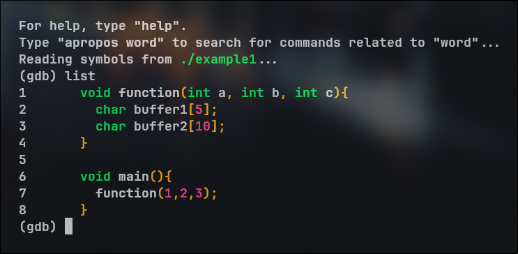
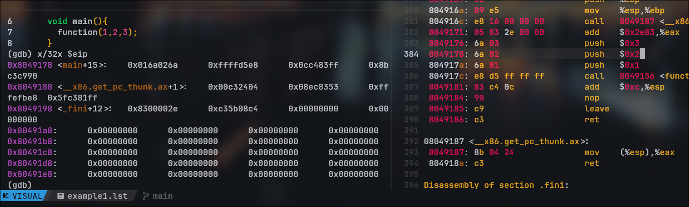

# Theory
- Buffer overflow
1. In the stack 
2. In the Heap
3. Return to libc attacks
- double free 
- integer overflow
- foramt string bugs

## Another instance example
 
 
 

%x gives the start of the address of the array 

%ebp takes 5 bytes  
`int` takes 4 bytes

## How to execute a buffre overflow attack 

### Get the machine code 
- Get the assemble source code the the program 

- Disassemble it to get the machine code of the main source
  use `objdump -disassemble-all <object-file>.o` to get the machine code 

### Find potential buffer overflow location in an application 

- Put machine code in large string 

- fill the remaining part of the large string with buffer values 

## Buffer overflow

Worm CODERED - released on 13th july 2001 
infected 359000 computers by 19th july 
targets microsoft's IIS webserver 

eip - Extended Instruction pointer 
esp - Extended Stack pointer
ebp - Extended Frame pointer [base pointer]

# Practical 

## Learning to trace the dubgging in runtime using GDB [ names as `example1.c` in buffer package ]

> [!IMPORTANT]
> The way to compile a source code to machine code is with a little less proctection as by default `GDB` compiles in a protected way . Therefore you cannot use the object file to exploit it.   
> The flags to lighten the security are -   
 - `-fno-stack-protector`  
        This removes protection from the stack of the program . To be precise - it removes the protection to the memroy that the program uses - which is a stack .   Which is very much essential in order to load the instruction of the attack to the stack .   
 - `-z execstack`  
        This gives executable permission/power/capability to the stack which the program uses in order to `ececute` that instruction. Without with the instruction is just a plain text.   
 - `-no-pie`  
        `pie` here stands for `Position-Independent-Executable` ensures that the binary is `not` position independent. So it executed the code in the fixed memory part all the time , thereby easing the attacker to write only one script to exploit the `return-to-address` . Elsewise he would have to check the address on every execution and script the attack.   
- `-g` 
        Allows to have debugging flags so that while debugging the program you don't have to check the current address of the program execution in the stack , match it with the disassembly and then understand what instruction is being executed . As this helps you to readily see the names of the varibles and functions and note which instruction set is being executed at that point of time.

GDB traces the programming line by line - where each line is known as a instruction .  
When you load the program with the object file - you can run the program line by using the command `single instruction` in short `si`.  
 `Program`    
Quick recap- in order to disassemble a program - convert to executable file and use `objdump --disasseble-all <object-filename> ` 
There you will find the whole disassembly of the entire binary and not just your code like the .init [ init  section ], the .plt [ procedure linkage table ] , .got [ global offset table ], .text [ main program that was written by the `user` ].   
`Disassembly`    
`List in gdb`    
`Running a single instruction`     
`executing single instruction and fining instruction register address` 
  
The coolest way to understand / trace the execution would be the `disassemble` in the `gdb` .  `cooler Way`    
On the RAM - the location and the value that has been stored   `Storage`  

   
While you are running the program - use `info locals` to get the value of the locals at that instance and `info registers eip esp ebp` to get the value of these registers at those instance .    

