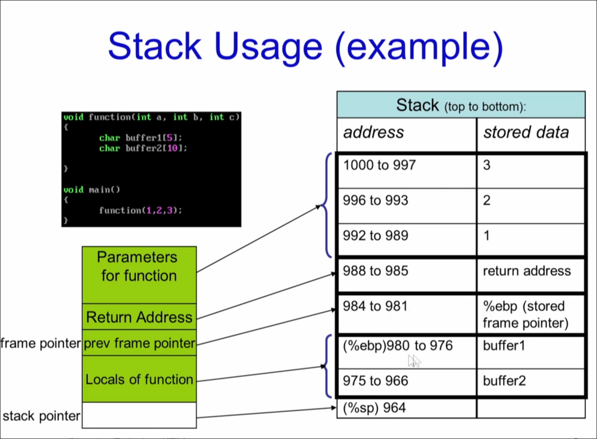
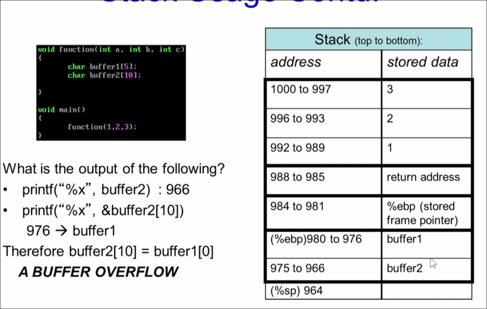

# Types of bugs in program 
- Buffer overflow
1. In the stack 
2. In the Heap
3. Return to libc attacks
- double free 
- integer overflow
- foramt string bugs

%x gives the start of the address of the buffer  

%ebp takes 5 bytes
int takes 4 bytes

# Buffer overflow
Worm CODERED - released on 13th july 2001 
infected 359000 computers by 19th july 
targets microsoft's IIS webserver 
 

eip - instruction pointer 
esp - stack pointer
ebp - frame pointer [base pointer]
