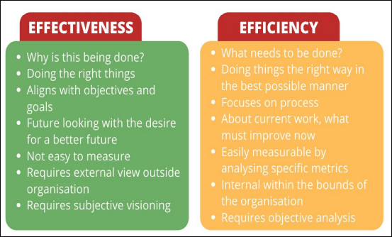
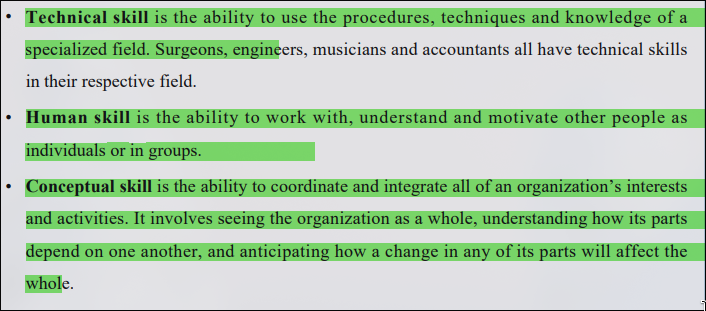
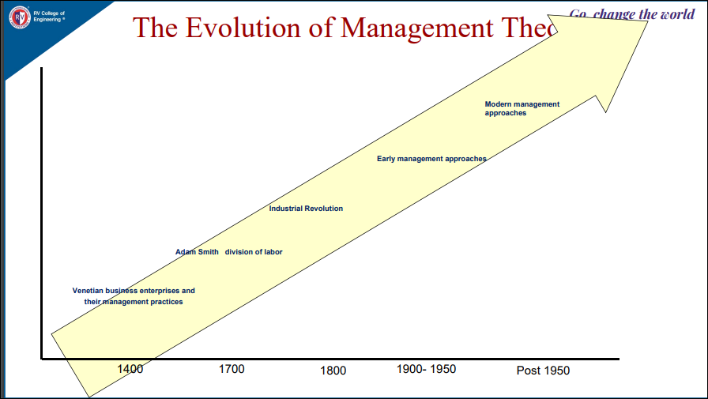
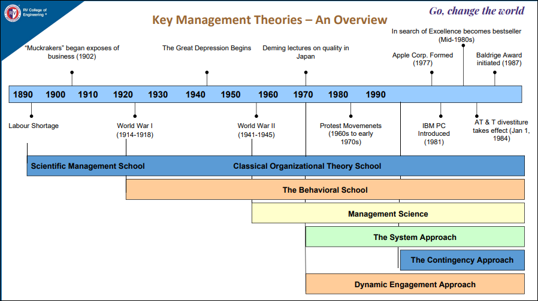
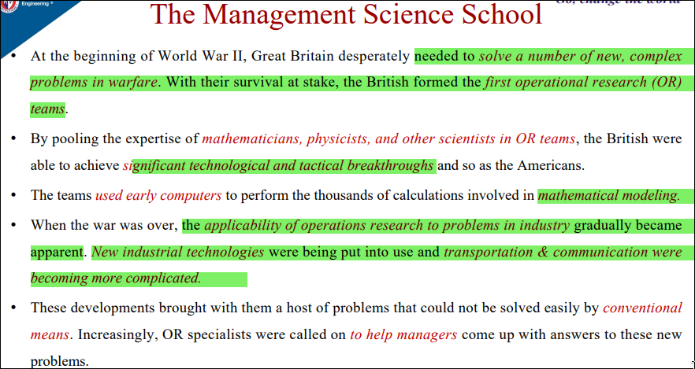
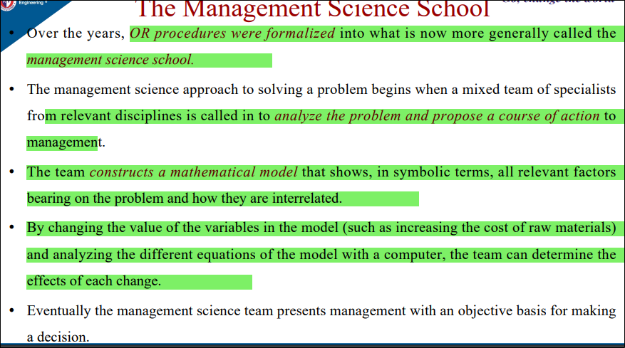
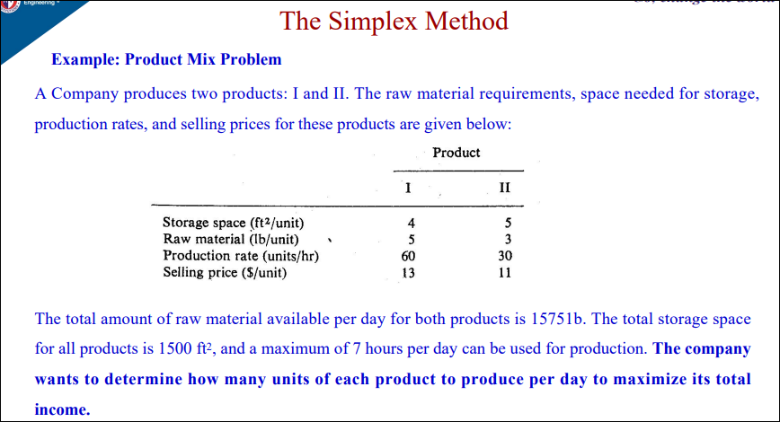
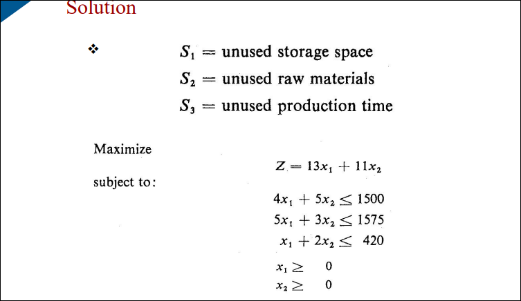
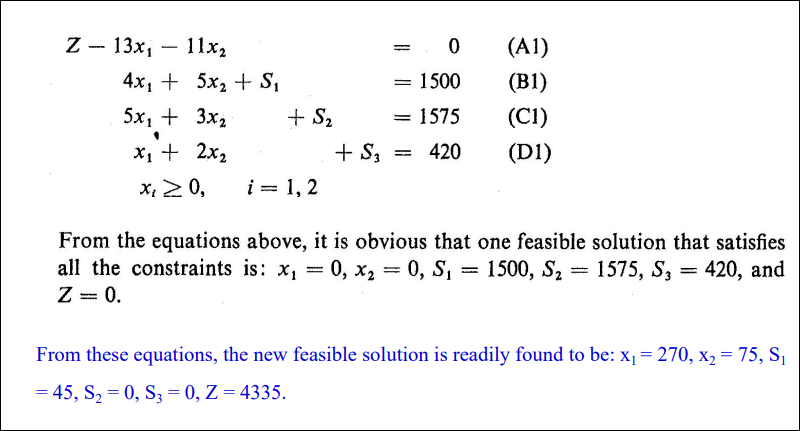

# Principles of Management and Economics 

---

"Management is a process of planning, organizing, staffing, directingand controlling to accomplish organizational objectives through the coordinated use of human and material skills".- prof Moore

"Management is the process of designing and maintainingan environment in which individuals working together in groups,accomplish their aims efficiently and effectively”. - Koontz

It enables the optimum use of resources through meticulous planning and control at the workplace.

Organization Management gives a sense of direction to the employees so that, they are well aware of their roles and responsibilities and know what they are supposed to do in the organization.

Efficiency (resource usages) is the ability to minimize the use of resources in achieving organizational objectives - “doing the things right”. 

• Effectiveness (goal attainment) is the ability to determine appropriate objectives - “doing the right thing”.

## planning
Planning is the basic function of management. It deals with chalking out afuturecourseofaction and deciding in advance the most appropriate course of actions for the achievement of pre-determined goals.

## Organising

“To organize a business is to provide it with everything useful or its functioning i.e. raw materials, tools, capital and personnel”.

## Staffing

The main purpose of staffing is to put the right man on to the right job

## Leading
Leading is that part of managerial function which actuates the organizational methods to work efficiently for achievement of organizational purposes.

## Controlling

According to Koontz & O’Donnell,
“Controlling is the measurement & correction of performance activities of subordinates in order to make sure that the enterprise objectives and plans desired to obtain, are as being accomplished”.

## Types of managers

### First-line manager | TECHNICAL SKILLS [aka lower level manager] [aka supervisory / operative level manager]
>    supervisor, foreman, section officer, superintendent
emotional intelligence and performance is of utmost important

### Middle manager | HUMAN SKILLS
>The branch manger or department level manager
They devote more time to organizational and direcitonal functions, problem solving,team building
They are responsible for coordinating the activites within the division or department

### Top level manager | CONCEPTUAL SKILLS [too much responsiblity]
>It consists of board of directors, chief executives or managing directors
Devotes more time on planning and coordination functions,delgation,leadership
They lay down the objectives, strategic plans and braod policies of the enterprise
Necessary instrucitons for prepartions of department budgets, procedure, schedules
It controls % and coordinates all the activites of all the departments
Responsible towards the sharesholders

# challenges of Management 
The need for vision
the need for ethics
the need for reponsiveness to cultural diversity

# Evolution of management theory

# Key theories

# Scientific Management School
> Scientific Management theory arose in part from the need to increase prductivity , and the only way to increase that was to increase efficiency of worker
Then ** Frederic W. Taylor ** [1856-1915] laid 4 basic principles

1. Development of a true science for management.
    so that the best method for performing could be pre-determined  
2. The scientific selection of workers.
    so that each worker would be given responsibility for the task for which he or she was best suited for - [Functional foremanship]   
3. The scientific education and development for the workers  
4. Intimate friendly cooperation between management and workers  

All this by Frederic Tayler was based on production-line time studies
 he broke down each job down into components ->
 designed the quickest and best methods of performing each componenet.

This way he could conclude how much amount of work workers should be able to do with the equipment and material at hand

he went out of character of a scientist and encouraged --
 to pay more productive workers at a **higher rate** than others using a '_scientifically correct rate_ '

This made the workers to surpass their previous performance standards to earn more pay.
Taylor thought he was coolman      and called his plan the **Differential rate System**

# The classical Organisation Theory School
Henri Fayol [1841-1925] - dean
is generally hailed as a founder of the classical management school,

Taylor [coolman](../pics/coolman.gif) was basically concerned with the organizational functions.
Fayol was interested in the **Total orgranization and focused on management**

he wanted to be cooler than taylor [who has 4 principles] so  he listed 14 principles [he was the starlord]
- Divison of labor
- Authority
- Discipline
- Unity of Command
- Unity of direction 
- Subordination of the individual interest to the common good
- Remuneration
- Centralization
- The Heirarchy
- Order
- Equity
- Stability of the staff 
- Initiative
- Esprit de corps

# The behavioral School
Henri Fayol failed as the dean [typical starloard situation in any planned fight] 
His classical approach did not achieve sufficient production efficiency and workplace harmoney [what do you expect after 14 skibidi principles ]

to managers' frustrations, people did not alwasy follow predicted or expected patterns of behavior [no one listens to starlord]

Therefore interests increased in helping mangers deal more effectively with the _people side_ of their Organisation

[helping inventing gadgets would be good but this is POME]

# Relational Theory - The Human Relations movement
> when employee management stiulates more and better work, the organiationhas effective human relations; when morale and efficiency deteriorate, its human relations are said to be ineffective

---

The human relations movement arose from early attemps to systematically discover the social and psychological factors that would create effective human relations

# The Hawthorne experiments
Western Electric Company from 1924 to 1933. These eventually became known as "Hawthrone Studies"
because many of them were performed at Western electric hawthorne plant by Elton Mayo near Chicago. They were

- Illumination experiments
- Relay Assembly Test Room
- Interviewing program
- Bank Wiring Test Room

## Illumination experiments [1924-27]
> These experiments were performed to findo out the effect of different levels of illumination (lighting) on productivity of labour.
Surprisingly the productivity increased when the level of illumination was decreased.
It was concluded that factors other than light were also important.

## Relay Assembly Test Room Study [1927-29]
> Under this  test two small groups of six female telephone relay assemblers were selected. Each group was kept in separate rooms. 
time to time changes were made in working hours, rest periods, lunch breaks, etc. 
They were allowed to chose their own rest periods and to give suggestions. 
but output increase in **both** control rooms.

it was concluded that social relationship among workers,participation in decision-making, etc. had a greater effect on productivity than working conditions

## MASS Interviewing Programme [1928-30]
21,000 employees were interviewed over a period of three years to findout reasons for increased productivity. It was concluded that productivity can be increased if workers are allowed to talk freely about matters tha are impornant to them.

## Bank Wiring Observation Room Experiment [1932]
A group of 14 male workers in the bank wiring room were placed under observation for six months. A workers' pay depended on the performance of the group as a whole. The researchers thought that the efficient workers will put pressure on the less efficient workes to complete the work. however , it wsa found that the group established its own standards of output, and social pressure was used to achieve the standards of ouput

# Conclusion of Hawthorne Studies / Experiments
- The _social and psychological factors_ are responsible for workers's productivity and job welfare. Only good working considitions are not enought to increase productivity.

- The _informal relations_ among workers influence the workers behavious and performance more than the _formal relations_ in the orgranisation

- Employees will perform better if they are allowed to participate in _deicision-making_ affecting their interests.

- Employees will also work more efficiently ,when they believe that the management is interestd in their welfare.

When employees are _treated with respect and dignity_, their performance will improve.

- Financial incentives alone cannot increase the performance. _Social and Psychological needs_ must also be satisfied in order to increase productivity.

- _Good communication between the superior and subordinates_ can improve the relations and the productivity of the subordinates.

- _Special attention and freedom to epress their views_ will improve the performance of the workers.

# Criticism of Hawthorne Studies / Experiments
- **Lacks Validity** : They were conducted under controlled situations. These findings will not work in real setting. The workers under obervation knew about the experiments. Therefore, they may have improved their performance only for the experiments

- **More Importance to human aspects** : Human aspects cannot improve production. Production also depends on technological and other factors .

- **More emphasis on group Decision-making** : In real situations, individual decision-making cannot be totally neglected especially when quick decisions aer required and there is no time to consult others.

- **Over Importance to Free of Workers** : It does not give importance to the constructive role of the supervisors. In reality too much of freedom to the workers can lower down their performance or productivity.

# The Management Science School

Operational research - OR teams 

### Heck there is even a problem give to mechanical in POME's unit 1 ppt 🤦

# The systems approach

This approach 
- views the organisation as a unified, purposeful system composed of interrelated parts.
- gives manager a way of looking at the orgranization as a whole and as a part of the larger external environment.
- activities of any segment of an orgranisation affexts in varying degrees , the activity of every other segment.
- Systems oriented production managers make scheduling devisions only after they have indentified the impact of these decisions on other departments and on the entire orgranization.

it has
subsystem 
synergy
open / closed system 
boundaries
flow

It has subsystems,synergy [separate deparment within an orgranisation cooperate and interact], open or closed systems. open system boundaries is flexible while closed's is rigid. 

>![NOTE] 
> Systems theory calls attention to thedynamic and interrelates nature of organizations and the management task. With a systems perspective, general manager can more easily maintain a balance between the needs of various parts of the enterprises and the needs and goals of the whole firm

# The Contingency approach
aka situational approach was developed by managers, consultants and researchers who tried to apply the concepts of the major schools to real life situations

This was becuase when methods were highly effective in one situation, failed to work in other situations. Results differ because situations differ, a technique that works in one case will not necessarily work in all cases

so [enimem incoming]
According to contingency approach, the manager's task is to identify which techniques will, in particular situation, under particular circumstances and at a particular time, best contribute to the attainment of the management goals.

# summin it up

Direct action elements : stakeholders, unions, suppliers who directly influence an organisation
Indirect action elements: technology, economy, politics of a society [sometimes have the potential to become direct action elements]

CSR1 : *Coorporate social responsibility* : focuses on what an orgranization does that affect the society in which it exists. 
CSR2 : *Coorporate social responsiveness* : is a theory of social responsibility that focuses on how companies respod to issues, rather than trying to determine their ultimate social responsibility.

In business most ethical questions fall into one or more of four categories:
- societal
- stakeholder 
- internal policy
- peronal [individual]

# Tools of Ethics 

- Values : relatively permanent desires that seem to be good in people, like peace or goodwill.
- Rights : Claims that entitle a person to take a particular action.
- Duties : Obligation to take specific steps or obey the law.
- Moral Rules : Rules for behavior that often become internalized as moral values

