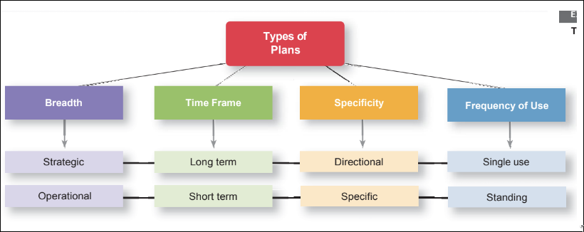
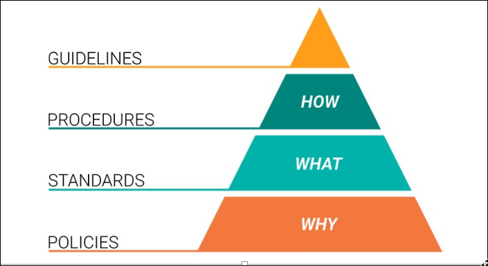
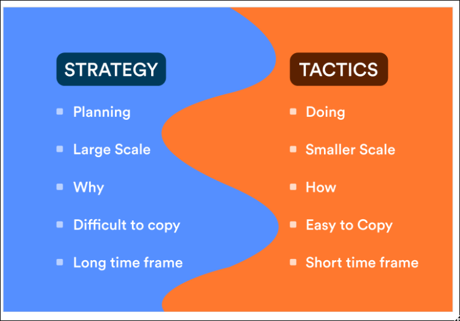
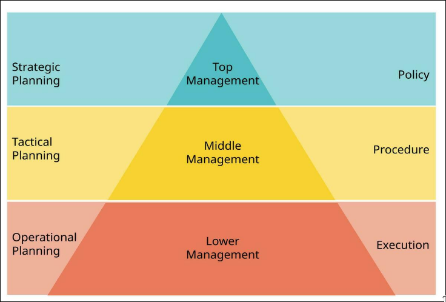
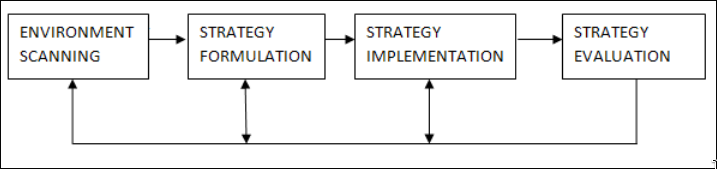
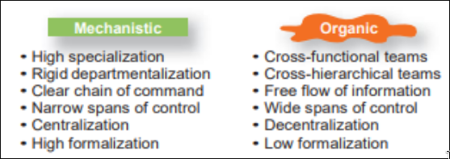
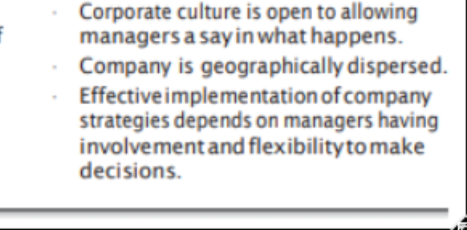

# Planning

Planning is concerned with both what an organization wants to accomplish (ends) and how it will achieve these aims (means). Formal planning, the type of planning focused on here, involves:␍
●	Defining specific goals that cover a certain time frame. 
●	Writing and sharing goals with all members of the organization. This reduces ambiguity and promotes a shared understanding of goals.
●	Formulating plans for achieving the established goals.

## Advantages

- Provides Direction
- reduced uncertainity
- Minimizes waste and redundancy 
- Establishes Controls standards

> **means-ends chain** Effectively designed organizational goals fit into a hierarchy so that the achievement of goals at low levels permits the attainment of high‐level goals. This process is called a means‐ends chain because low‐level goals lead to accomplishment of high‐level goals.

# Types of Planning

long term - short term = time
single use - standing = frequencyt of use 
directional - specific = Specificity
strategic - opetaional = Breadth

### 4 main types

- operational - from the braedth
- strategic  - from breadth
- Tactical - required by me 
- Contingency - ma'am said

#### operational
how things need to happen 

It provides detailed guidelines for accomplishing the organization's mission and involves setting precise, measurable operational goals.␍
Operational Plan: An operational plan is one that a manager uses to accomplish his or her job responsibilities.

Types of Operational Plans:␍
●	Single-Use Plans:␍
○	Created for one-time activities or events.␍
○	Examples: Special sales campaigns, specific project budgets.␍
●	Ongoing Plans:␍
○	Provide a long-term framework, revised periodically.␍
○	Examples include:␍
■	Policies: Broad guidelines for decision-making (e.g., hiring, performance appraisals).␍
■	Procedures: Step-by-step instructions for routine tasks (e.g., purchasing processes).␍
■	Rules: Explicit "do's and don'ts" for employee behavior (e.g., tardiness policies).␍
Purpose:Operational plans help supervisors, team leaders, and managers execute their responsibilities effectively, supporting broader tactical plans.␍

Operational Goals:␍
●	Specific and measurable outcomes.␍
●	Examples:␍
○	"Process 150 sales applications per week."␍
○	"Publish 20 books this quarter."␍
Key Features:␍
●	Define who, what, where, how, and how much.␍
●	Ensure consistency in handling recurring tasks.␍
●	Promote fairness and safety through clearly defined rules and procedures.␍

####	Strategic Planning␍
Definition:Strategic planning focuses on why things need to happen. It involves big-picture, long-term thinking and starts with defining the organization’s mission, vision, and values.␍
Purpose:␍
●	Provides a high-level overview of the entire organization.␍
●	Serves as the foundation for long-term decision-making.␍
●	Guides the organization from its current state to its desired future.␍
Scope:␍
●	Covers a time frame of 2 to 10 years.␍
●	Involves collaboration across all management levels to ensure alignment.␍
Key Components:␍
●	Vision: The organization’s aspirations for the future.␍
●	Mission: The core purpose and reason for existence.␍
●	Values: Principles guiding decisions and actions.␍
Process:␍
●	Top-Level Management: Defines the organization's overarching objectives and sets the direction.␍
●	Lower-Level Management: Develops compatible plans and objectives aligned with the strategic goals.␍
●	Integration: Ensures alignment between levels to create a cohesive plan.␍
Highlights:␍
●	Strategic plans focus on the organization as a whole, not individual departments.␍
●	Require multi level involvement to ensure harmony.␍
●	Serve as a framework for tactical and operational planning.␍
●	Drive long-term success by aligning efforts with the organization's mission and vision.␍

####	Tactical Planning
Definition:␍
●	Tactical planning focuses on what is going to happen. It breaks down high-level strategic plans into specific, focused, and short-term actions that support the broader strategy.␍
Purpose:␍
●	Converts strategic goals into actionable steps.␍
●	Provides direction for lower-level units within the organization.␍
●	Ensures alignment with the organization’s strategic vision.␍
Scope:␍
●	Covers a shorter time frame, typically less than one year.␍
●	Addresses specific tasks or projects within a division or department.␍
Key Features:␍
●	Specificity: Outlines detailed actions and tasks to achieve strategic objectives.␍
●	Responsibility: Identifies who is in charge at various levels.␍
●	Focus: Narrower scope compared to strategic planning, with clearly defined outcomes.␍
Process:␍
●	Middle Management:␍
❖	Translates the strategic plan into tactical actions.␍
❖	Focuses on short-term, achievable goals.␍
●	Coordination:␍
❖	Ensures all tactical plans align with and support the strategic plan.␍

####	Contingency Planning␍
Definition:Contingency planning involves preparing alternative courses of action to address unexpected events or changing circumstances that make the original plan inadequate.␍
Purpose:␍
●	Ensures adaptability and flexibility in unpredictable situations.␍
●	Provides a backup plan to mitigate risks and minimize disruptions.␍
●	Helps maintain progress toward organizational goals despite unforeseen challenges.␍
Key Features:␍
●	Adaptability: Anticipates potential changes and prepares alternative actions.␍
●	Flexibility: Keeps options open to quickly respond to unexpected developments.␍
●	Proactive Approach: Identifies risks and outlines responses during the planning process.␍
Importance:␍
●	Vital in a complex and dynamic business environment.␍
●	Helps managers respond effectively to events beyond their control.␍
●	Enhances the organization’s resilience and ability to recover from setbacks.␍
Process:␍
1.	Risk Identification: Assess potential risks or scenarios where plans might fail.␍
2.	Alternative Planning: Develop alternative strategies to address each identified risk.␍
3.	Implementation Readiness: Keep contingency plans updated and ready for deployment.␍
Key Principles:␍
●	Always anticipate change and prepare for unexpected events.␍
●	Incorporate flexibility into planning processes.␍
●	Ensure alignment between contingency plans and overall organizational goals.␍

Derived from the Greek word strategeia, meaning "the art or science of being a General."

#####	The Strategic Management Process␍
Managers can use strategic management as a methodical approach to understand the environment in which their firm planned and then takes action. A six-step framework for planning, implementing, and evaluating strategies effectively.␍
1. Identify Mission, Goals, and Strategies␍
●	Define the organization's purpose and current objectives.␍
●	Understand existing strategies to establish a starting point.␍
2. Perform SWOT Analysis␍
●	External Analysis:␍
○	Opportunities: Factors to leverage (e.g., market trends).␍
○	Threats: Risks to address (e.g., competition).␍
●	Internal Analysis:␍
○	Strengths: Assets that provide an advantage.␍
○	Weaknesses: Limitations to improve.␍

### Types of Strategy

#### Corporate 

> The Corporate Portfolio Matrix is a strategic tool that helps organizations analyze and manage their portfolio of business units, products, or investments to align with overall corporate objectives. It provides a framework for resource allocation and strategic decision-making based on the performance and strategic positioning of each unit.

> Boston consulting Group - BCG matrix

#### Competitive

- cost leadership 
- differentiation 
- focus

### five forces model
> Threat of new entrants
> Threat of substitute Products or Services
> Bargaining power of suppliers 
> Bargaining power of buyers
> Industry Rivalry

----

# Goals

## Types of goal setting

- strategic 
- performance 
- learning
- process
- outcome 
- social/ impact goal setting

# Organisational structure and design 

**Organizing** : arranging and structuring work to accomplish an organization goals. 

**Departmentalization** : After deciding what job tasks will be done by whom, common work activities need to be grouped back together so work gets done in a coordinated and integrated way. How jobs are grouped together is called departmentalization
 remember segregation 
   - functional departmentalisation 
   - geographical departmentalisation
   - products
   - process 

### Chain of command 

**Authority**

**Responsibility**

**uninty of command**

### Span of control

### Centralisatoin and decentralisation

 Centralization is the degree to which decision making takes place at upper levels of the organization. If top managers make key decisions with little input from below, then the organization is more centralized. On the other hand, the more that lower-level employees provide input or actually make decisions, the more decentralization there is.

> It is not an **either-or** concept so one company can be both centralised and decentralised

**Formalization** : Formalization refers to how standardized an organization’s jobs are and the extent to which employee behavior is guided by rules and procedures. In highly formalized organizations, there are explicit job descriptions, numerous organizational rules, and clearly defined procedures covering work processes. Employees have little discretion over what’s done, when it’s done, and how it’s done. 

## Centralisaton V Decentralisation

