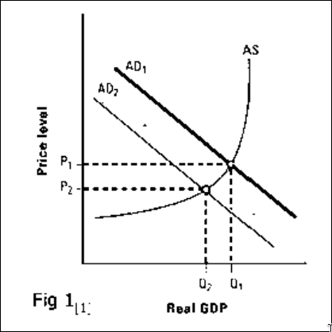
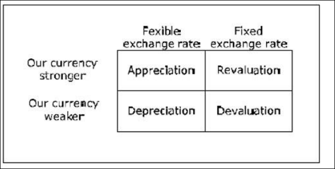

# Macroeconomics 

One model that is very popular in virtually all basic courses in macroeconomics all over
the world is the so-called neo-classical synthesis. As the name suggests, this is a combination
or a synthesis of two models, namely the classical model and the Keynesian model. In short,
the neo-classical synthesis claims that the Keynesian model is correct in the short term while
the classical model is correct in the long run.

## John Maynard Keynes 1930s - wrote book “The general theory of Employment, Interest, and Money - where wrote 
Say's Law does not apply in the Keynesian model.
The quantity theory of money does not apply in the Keynesian model.
The nominal wage level W is an exogenous variable in the Keynesian model.

Cross model: W, P and R are constant (and exogenous).  
IS-LM model: W, P is constant, and R is endogenous.  
AS-AD model: W is constant, P and R are endogenous.  
The full Keynesian model: W is exogenous (but not constant), P and R are endogenous

MundellFleming model – an extension of the neoclassical synthesis to an open economy where we
also analyse the exchange rate.

## British economist John Hicks first introduced the IS-LM model in 1937, 

## IS=LM

> The IS-LM model, which stands for "investment-savings, liquidity-money," is a
Keynesian macroeconomic model that shows how the market for economic goods (IS)
interacts with the loanable funds market (LM) or money market. It is represented as a graph
in which the IS and LM curve intersect to show the short-run equilibrium between interest
rates and output.

> The three critical exogenous variables in the IS-LM model are liquidity, investment and
consumption. According to the theory, liquidity is determined by the size and velocity of the
money supply. The levels of investing and consumption are determined by the marginal
decisions of individual actors.

> The IS-LM graph examines the relationship between real output, or GDP, and nominal
interest rates. The entire economy is boiled down to just two markets, output and money, and
their respective supply and demand characteristics push the economy towards
an equilibrium point. This is sometimes referred to as "the Keynesian Cross."

## Characteristics of the IS-LM Graph

In the IS-LM graph, the IS curve slopes downward and to the right. This assumes the
level of investment and consumption is negatively correlated with the interest rate but
positively correlated with gross output. By contrast, the LM curve slopes upward, suggesting
the quantity of money demanded is positively correlated with the interest rate and with
increases in total spending, or income.

Gross domestic product (GDP), or (Y), is placed on the horizontal axis, increasing as it
stretches to the right. The nominal interest rate, or (i or R), makes up the vertical axis.
Multiple scenarios or points in time may be represented by adding additional IS and LM
curves. In some versions of the graph, curves display limited convexity or concavity.

## Limitations of the IS-LM Model

Many economists, including many Keynesians, object to the IS-LM model for its
simplistic and unrealistic assumptions about the macroeconomy. In fact, Hicks later admitted 
model's flaws were fatal, and it was probably best used as "a classroom gadget, to be
superseded, later on, by something better." Subsequent revisions have taken place for socalled "new" or "optimized" IS-LM frameworks.

The model is a limited policy tool, as it cannot explain how tax or spending policies
should be formulated with any specificity. This significantly limits its functional appeal. It
has very little to say about inflation, rational expectations or international markets, although
later models do attempt to incorp

## AS-AD    

> Aggregate Supply is the total amount of goods and services in the economy available at
all possible price levels. Aggregate Demand is the amount of goods and services in the
economy that will be purchased at all possible price levels. In an economy, as the prices of
most goods and services change, the price level changes and individuals and businesses
change how much they buy. The aggregate supply curve on a graph illustrates the relationship
between prices and output supplied whereas the aggregate demand curve shows relationship
between price and real GDP demanded.

## The complete Keynesian model:

Wage inflation:
In this section, we will continue to develop the Keynesian model removing the
assumption of fixed nominal wages. We define wage inflation nw as the percentage average
increase in wages. Wages and wage inflation are still exogenous, i.e. they are not determined
within the model. One justification for this assumption is that wages often are determined by
agreements which often last for several years.

We do not need a new model to deal with inflation. Non-constant wages can be handled
within all three Keynesian models as long as they are exogenous. The reason we chose to let
wages be constant in the previous Keynesian models were entirely pedagogical - these
models are easier to understand when wages are constant.

Neutral inflation is defined as a situation where wage inflation is equal to inflation (in
prices). With neutral inflation, the real wages are constant. The Keynesian model does not
require neutral inflation and real wages may vary over time.

## Robert solow in the 1960s aka solow growth model / exogenous model

## Paul Romer endogenous 1980s -- technological progress 

> Unemployment and hours worked are directly related

In reality, this relationship need not hold. We may see an increase in the labor force (for
example from immigration) that is larger than the increase in employment which would lead
to an increase in both hours worked and unemployment but we disregard this possibility.

> The central bank has complete control over money supply

emember that the money supply is equal to the money multiplier times the monetary
base. We will assume that the money multiplier is constant and since the monetary base is
completely under the control of the central bank, the central bank will control the money supply

> Monetary policy = change in money supply

he central bank actually has other monetary policy instrument apart from being able to
determine the money supply. The most important one is the target interest rate for the
overnight market.

> There is just one interest rate 
think of “the interest rate” as the one-year
interest rate on government securities.

## The neo-classical synthesis:

The neoclassical synthesis was a post-World War II academic movement
in economics that worked towards absorbing the macroeconomic thought of John Maynard
Keynes into neoclassical economics. The resultant macroeconomic theories and models are
termed Neo-Keynesian economics. Mainstream economics is largely dominated by the
synthesis, being largely Keynesian in macroeconomics and neoclassical in microeconomics.
The term ‘neoclassical synthesis’ appears to have been coined by Paul Samuelson to
denote the consensus view of macroeconomics which emerged in the mid-1950s in the
United States.

## Exchange rate determination

### The law of one price
### Purchasing Power Parity
        >  The big Max index

### Purchasing Power adjusted exchange rates

# [robert] Mundel - [marcus] Fleming model

The Mundell–Fleming model, also known as the IS-LM-BoP (Balance of
Payments) model (or IS-LM-BP model), is an economic model first set forth (independently)
by Robert Mundell and Marcus Fleming. The model is an extension of the IS-LM model.
Whereas the traditional IS-LM model deals with economy under autarky (or a closed
economy), the Mundell–Fleming model describes a small open economy.

he Mundell–Fleming model portrays the short-run relationship between an economy's
nominal exchange rate, interest rate, and output (in contrast to the closed-economy ISLM model, which focuses only on the relationship between the interest rate and output). The
Mundell–Fleming model has been used to argue that an economy cannot simultaneously
maintain a fixed exchange rate, free capital movement, and an independent monetary policy.
This principle is frequently called the "impossible trinity," "unholy trinity," "irreconcilable 
trinity," "inconsistent trinity" or the "Mundell–Fleming trilemma."
