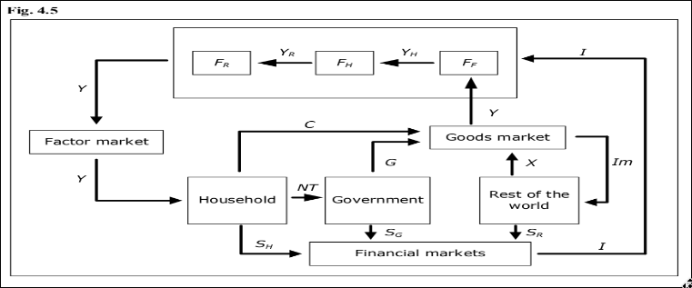

# Macroeconomics Indicators
- prices and inflation - Consuimer Price index [CPI ] 250 - 275 a year thats 10% increase
- Exchange rate
- GDP
- Components of GDP
- The labour Market
- Money and Banks
- Interest rate
- Macroeconomics Models
- Numricals on GDP calculation
- ESg overview

## Prices and inflation

The Great Depression [1929-1939]

The US inflation rate peaked at 13.5% in 1980 during the period of oil price raise from 1970s
US CPI rose by 6.8% in 2021 fastest since 1982 

> [!IMPORTANT] Quantity theory of money

Quantity theory of money -- relationship between price and time 

MV = PY
m - money supply
v - velocity of Money
p - price level
y - real output

 > [!important] Laspeyres formula

to calculate CPI
CPI = [ cost in cur_period times 100 ] / [ cost in base period ] 

## Exchange Rates

managed float system - central banks intervene occasionally to influence exchange rates

appreciation - makes import expensive while exports are profitable as there is more competition

conversely
decreciation - makes import more profitable but exports more hurtfull since there is no competition

> japan followd appreciation making its yen fall by 10% every years while exports being more profitable but the domestic rates are very high therefore CPI increases

### Flexible exchange rate system
market forces of supply and demand determine the exchange rate without the government's intervention
for ex: US dollars - provides adaptability but violates import export business

### Fixed exchange rate system
pegs a country's curreny to another country or a basket of countires .
for ex : 7.8 HKD/USD

This system offers stability for trade and investment but demands significant foreign reserves to maintain the peg and limits responses to economic shocks.

### Managed Float Systewm 
This is a **hybrid** system -- involves central banks intervention to prevent extreme volatility
for ex: India , RBI steps in during excessive fluctuations. It balances flexibility with some control.

### Monetary Union
A monetary union involves multiple countries adopting a single currency, such as the euro in the EU.
There are no internal exchange rates, but the shared currency’s value fluctuates against others. This system requires coordinated fiscal and monetary policies but eliminates exchange rate risk within the union.

Effective Exchange Rate=(0.4×90)+(0.3×11)+(0.3×75)
Effective Exchange Rate=(36+3.3+22.5)=61.8 INR/USD

## GDP

### Defination
Gross Domestic Product (GDP) is a fundamental economic indicator that measures the total market value of all final goods and services produced within a country over a specific time period, typically a year or a quarter. It serves as a comprehensive measure of economic activity and output.

### REAL v Norminal
Real GDP adjusts nominal GDP for inflation to provide a clearer picture of economic growth. It measures the actual increase in production and income by dividing GDP by a price index, typically a GDP deflator. This adjustment is essential for comparing economic performance over time or across different economies. For example, if prices double over a year, nominal GDP would also double, but real GDP growth would reveal that the economy’s output actually grew at a slower pace. The GDP deflator is preferred over CPI for these calculations because it measures the price evolution of a broader set of goods and services included in GDP.

### Growth
Real GDP growth excludes the effects of inflation, providing a more accurate measure of how much the economy has grown. It reflects genuine increases in production and income rather than price changes. For instance, if real GDP grows by 3% over a year, it indicates that the economy has expanded by that percentage after adjusting for inflation. This metric is crucial for understanding the health of an economy and guiding policy decisions.

### GDP as a flow 
GDP is a flow variable, measuring economic activity over a specific time period rather than a stock variable, which measures a quantity at a point in time. It tracks the flow of income, spending, and production within an economy

## Components of GDP
To better understand GDP, we utilize the “circular flow model”, which shows how goods, services, and money circulate between various sectors of the economy. In this model, goods (and services) flow counterclockwise while money flows clockwise. Firms deliver finished goods to the goods market, and they are compensated for these goods, which equals GDP. Consumers receive these goods from the goods market and pay for them by providing factors of production (labor and capital) to the factor markets. Firms purchase these factors using the income they receive from the goods market.

#### value added 
A firm in this model adds value to products as they progress through the production process. This value addition is defined as the difference between revenue and the cost of goods.

#### how firm makes profits 
Firms are divided into three categories: FR (firms acquiring raw materials), FH (firms producing semi-manufactured goods), and FF (firms producing finished goods). GDP, denoted as Y, will flow from FR to FH and then to FF. The value added for each firm category must sum up to GDP:
●	YR is the total value of all goods going from FR to FH.
●	YH is the total value added by firms in the FH category.
●	Y – YH is the total value added by firms in the FF category (finished goods producers).This distribution ensures that the total return to factors of production (wages, rent, and profit) matches the sum of all value added in the economy

    

> Total Circular Flow = Private Consumption+ Public Consumption+ Investment+ Exports- > [!IMPORTANT]
 
Total Circular Flow of Money = Household Income+Firm Expenditures+Government Revenue+ Net Exports

> Net tax revenue (NT) is calculated as total taxes minus transfers.
> Disposable income (YDisp) is the income remaining after taxes and transfers

1.	Total Output Identity: By considering all arrows to and from the goods market, we have:                                                    Y+Im=C+I+G+X␍
    Here, YYY represents total output or GDP, ImImIm is imports, CCC is consumption, III is investment, GGG is government spending, and XXX is exports. The left-hand side (Y+ImY + ImY+Im) is the value of all finished goods flowing into the goods market, while the right-hand side decomposes all goods into these four categories.␍

C - consumption
I - investment
G -  government spending 
X - export

y - total output or GDP
Im - import

X-Im =  net export

Expenditure = Y = C+I+G+X-Im

### value added 
y = sum of (output - imtermediate inputs)

### income
Y = W+I+R+P 
W - wages 
I - Interest 
R - rents 
P - profits 

### capital
By capital, we typically refer to manufactured goods that are used to produce other goods and services but are not consumed in the production process. This includes physical assets like machines, computers, factories, and infrastructure. To distinguish it from financial capital, which consists of assets like bank deposits, stocks, and bonds, we often refer to capital as fixed capital. Fixed capital can be divided into three main categories:

1.	Physical Capital: This includes tangible assets such as machinery, equipment, buildings, and infrastructure that are used in the production process. Physical capital enhances productivity and allows for the production of goods and services.␍
2.	Human Capital: This refers to the skills, knowledge, education, and experience embodied in individuals that enhance their ability to perform tasks and contribute to the economy. It is a crucial component of economic growth and development.␍
3.	Social Capital: This includes networks, relationships, and institutions that facilitate cooperation and coordination among individuals and groups. It contributes to the efficient functioning of markets and communities.

### Investments 
Investment in economics refers to the process of allocating resources to acquire new assets or improve existing ones to increase future productive capacity. It encompasses gross investment, which includes all finished goods produced but not consumed. This involves both gross fixed investment and changes in inventories.

Gross fixed investment refers to the purchase of new fixed assets such as machinery, buildings, or equipment that will be used in production.

Changes in inventories occur when there are fluctuations between production and consumption. An increase in inventory indicates that production has outpaced sales, which counts as positive investment. Conversely, a decrease suggests that demand has exceeded production, signaling a negative investment. These inventory changes reflect businesses' responses to market dynamics and their strategies to manage stock levels.

Net investment, on the other hand, is calculated by subtracting depreciation from gross investment. Depreciation measures the reduction in value of capital assets over time due to wear and tear. Net investment represents the real increase in capital stock in an economy, indicating genuine additions to productive capacity over a specific period. This distinction is crucial because while capital is a stock variable (measured at a particular point in time), investment is a flow (measured over a period).

