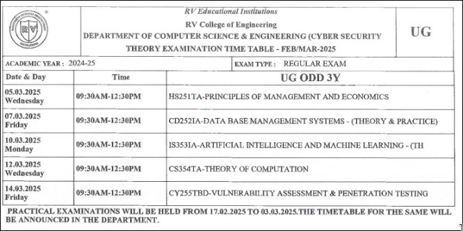
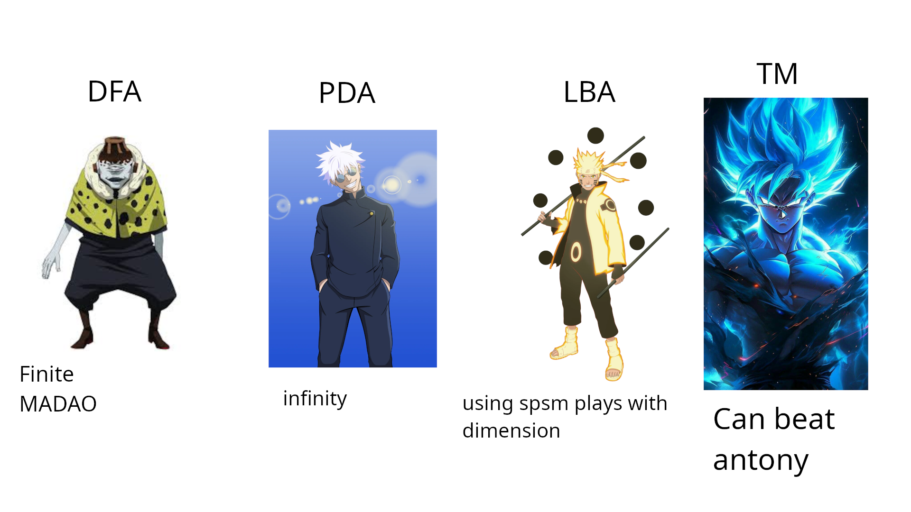

cd 3rdyear/ && cd 5thsem/
---
Disclaimer
---
I don't claim to own the materials -- there are too many contrbutors to mention

I need to study ## bro

yo BTW use pdfroom's a manga guide to - stuff like [linear algebra / databses ] - By far the coolest stuff I have ever seen

The moment you understand this - you pass **TOC**  
Suraj's Hierarchy >>>>> Chomsky hierarchy   

some links I referred to --   <pre>
ai -- [oneshot](https://youtu.be/yiXAmkimZRQ?si=Usym6PnxujQlkidl) [1](https://youtube.com/playlist?list=PL4gu8xQu0_5JrWjrWNMmXNx4zFwRrpqCR&si=8fx8lQil25zp3j-6) [2](https://youtube.com/playlist?list=PLxCzCOWd7aiHGhOHV-nwb0HR5US5GFKFI&si=wfZ98qeYOs_Oe5TU)  
ml -- [oneshot](https://youtu.be/2oGsCHlfBUg?si=S0eVHm3iJybWnwW8) [1](https://youtube.com/playlist?list=PL4gu8xQu0_5JBO1FKRO5p20wc8DprlOgn&si=p6g4Ki1yqhZKPqpp) [2](https://youtube.com/playlist?list=PLxCzCOWd7aiEXg5BV10k9THtjnS48yI-T&si=kFD9IfhebTS3XkU0)  
dbms -- [oneshot](https://youtu.be/YRnjGeQbsHQ?si=lvGEx10HpdvbBeOj) [1](https://youtube.com/playlist?list=PLxCzCOWd7aiFAN6I8CuViBuCdJgiOkT2Y&si=H_ErVB3-50Pfm3y3) [2](https://youtube.com/playlist?list=PLz8TdOA7NTzToibk7WXtD5qvBMnkZkwh7&si=7U5CI1UDYNpkdXNK) [3](https://www.youtube.com/playlist?list=PLmXKhU9FNesR1rSES7oLdJaNFgmuj0SYV_)  
toc -- web: [1](https://www.geeksforgeeks.org/chomsky-hierarchy-in-theory-of-computation/)  &nbsp;&nbsp;&nbsp;&nbsp; yt: [bestoneIG](https://www.youtube.com/playlist?list=PLXj4XH7LcRfBkMlS_9aebcY78NLFwhE4M) [oneshot](https://youtu.be/gK_V_lzNQg8?si=GGcZymn-8aF7heGl) [oneshot2](https://youtu.be/9kuynHcM3UA?si=MlWawHikB348GmXt) [1](https://youtube.com/playlist?list=PL6xbXi2C3sePDwyboAcu7l1UYuUT2SWYd&si=PPKIUY0AlBA0_dcK) [2](https://youtube.com/playlist?list=PLLvKknWU7N4zvTGcw9N2_7eZSTTkryb0U&si=Kz2HIPP858ubKONt) [3](https://youtube.com/playlist?list=PLz8TdOA7NTzTdFM93ak-qBVpX1aMFuw9c&si=BeIEHsG-4JiHy3FJ) [4](https://youtube.com/playlist?list=PLxCzCOWd7aiFM9Lj5G9G_76adtyb4ef7i&si=1_Wjth3nZGsrRjvm) [5](https://youtube.com/playlist?list=PLYYgQGrHw6sJpwTatmafBmkZ77HehcXrz&si=UdbeoOnJpIsSRpaZ) [6](https://youtube.com/playlist?list=PLJQdRs133JxaQ3zgGyiPC_BO-qDM584WO&si=xGszsHqA1w1nbFZ-) [7](https://youtube.com/playlist?list=PLmDcustIWVJ36xMdS44tdHGQZp3abKU_F&si=4Wbmr8tB_IBcp4b3) [8](https://youtube.com/playlist?list=PLOY1Y3rXv9p_bQtnjF33xPZEGmba7Kwlh&si=mPX1aq_d_O-zdWRL) [9](https://youtube.com/playlist?list=PLmXKhU9FNesSdCsn6YQqu9DmXRMsYdZ2T&si=bxnBGYWCsQV2-rtz) 

information security - 5 -- [1](https://youtube.com/playlist?list=PLyqSpQzTE6M-q0Xgn0icEHvUS7WQxvenv&si=TaMqhTV1-jbG8fTq) [2](https://youtube.com/playlist?list=PL0ABbZ9l6XI5y8yym50mVVP_m1WrDghff&si=7ak7odMV39ReKcAo) [live1](https://www.youtube.com/live/purXxH4Z1GY?si=UdW6LxZZ2_7xzHX9)  [live2](https://www.youtube.com/watch?v=o0nASBQh15M&ab_channel=InteractiveSessionswithIITProfs-NPTEL)

